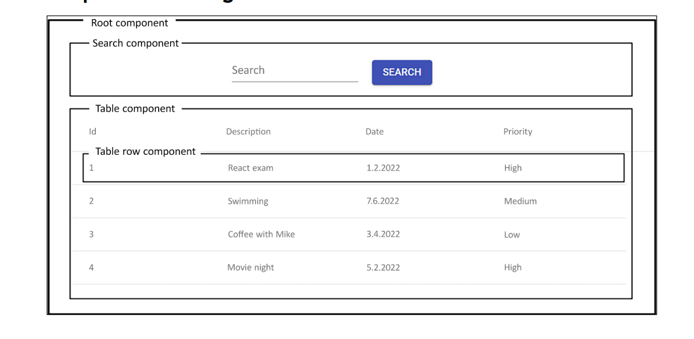

# 입실 체크 해주세요 !! 🎈

1. cardatabase3를 기준으로 합니다.
  - JWT Authentication까지 적용된 부분

2. React 자체 관련 수업들을 진행하기 위해서 CarDatabase 연결 전 이론 및 실습이 있을 예정

# 과제
1. korit_12_react 폴더를 적절한 위치에 생성하세요.
2. learn_logs 폴더를 생성하세요.
3. 20260303.md 파일을 생성하고 과제를 타이핑하세요.
4. github에 korit_12_react repository를 생성하세요.
5. push까지 완료하세요.

## 풀이 순서
git init
git config user.name "여러분깃허브아이디"
git config user.email "여러분@깃허브.이메일"

# VS code react extension 설정
1. ESlint
    - JavaScript용 오픈 소스 린터로, 소스 코드에서 문제를 찾아 수정하는 것을 도와줍니다(빨간줄 잘 띄워준다는 의미).
2. Reactjs code snippets
    - 단축어 지원해줍니다.

# React 앱 만들기 및 실행
저희는 vite project를 사용할겁니다. Next.js나 Remix와 같은 다른 리액트 프레임워크가 존재하지만, 기초 학습용으로는 얘가 좀 낫습니다. 예전에는 CRA(Create React App)을 가장 많이 이용했으나 현재 이용률도 감소하고, React19에서는 공식적으로 지원 중단되었습니다.

## react 앱 만들기 process
1. vs code 상에서 ctrl + shift + `(백틱)으로 터미널 엽니다.
2. npm 명령어를 사용할겁니다(저희는 4.4 버전으로 만들 예정입니다).
`npm create vite@4.4`
    - 이상의 명령어를 엔터 칠 경우에 안되시는 분들은 node.js가 없기 때문입니다.
    - `node -v, node --version` / `npm -v, npm --version`
3. chrome에서 node.js 검색합니다. - LTS 버전 다운 받았습니다.
    - 설치 후 vs code를 껐다 켤 것.
    - 그래도 안된다면 혹시 powershell이거나 cmd일 수 있으니 git bash로 터미널을 열어서 `node -v` / `npm -v`를 확인할 것.
4. `npm create vite@4.4`
    - y 눌러서 ok to process
    - 저희 수업 기준으로 framework 선택하는 부분에서 -> React
    - variant 선택 부분에서 -> JavaScript(추후 TypeScript 적용 예정)
    - 그러면 막 설치한 다음에 리눅스 명령어가 몇 개 나옵니다.
        - cd 프로젝트명 으로 나오는데, 저희는 learning_logs와 분리하기 위해 별개의 vs code 창을 띄웠습니다.
        - `npm install` : 이거 매우 중요합니다.
            - SpringBoot 상에서 build.gradle에 있는 의존성들 목록이 있는 것처럼 react 프로젝트에는 package.json이라고 하는 곳에 의존성 목록들이 존재합니다. 그것들을 설치해야 프로젝트가 실행 가능합니다.

        - `npm run dev` : 실행시키기 위한 명령어(커스텀 가능)

        - 이상의 수업에서 수강생들이 많이 하는 실수 목록
            1. 오랜만에 스프링부트 했을 때 왜 실행이 안되나요 했을 때와 동일합니다. 프로젝트 명이 가장 상위로 잡혀야만 합니다. korit_12_react에서 npm install / npm run dev 하시면 안됩니다.

## React 앱 debugging하기
1. chrome -> react developer tools를 검색 -> 설치 후에 chrome 재실행
2. react project 상에서 f12를 통해 개발자 모드를 진입하면 저희 js 배울 때 console있는 부분 맨 끝에 무슨 보라색인지 파란색인지 리액트 아이콘 있는 Components라는 애가 새로 생겼습니다. 이는 리액트 컴포넌트 트리가 시각적으로 표현되며, 검색창을 이용해서 특정 컴포넌트를 검색하는 것이 가능합니다.
3. Console 파트에서 JS 코드의 메시지, 경고, 오류를 확인할 수 있습니다.
4. Network 파트에서는 저희가 SpringBoot에서 봤던 401 / 404 / 500 등의 요청 및 응답을 확인할 수 있습니다.

# Starting React

## React Component를 만드는 법
리액트는 UI를 위한 JS 라이브러리에 해당합니다(프레임워크/라이브러리의 의미는 다양하긴 합니다). 15 버전 이후부터는 MIT 라이선스에 따라 개발되는 중입니다. 리액트는 독립적이고 재사용이 가능한 컴포넌트를 기반으로 작동하는 프레임워크라고 정의할 수 있습니다.




이상의 구조를 바탕으로 설명합니다.

현재 이미지에서 root 컴포넌트에는 검색 컴포넌트와 표 컴포넌트라는 두 개의 하위 컴포넌트가 존재합니다. 그리고 표 컴포넌트에는 표-행 컴포넌트라는 하위 컴포넌트 하나가 존재합니다. 리액트에서 이해해야 할 중요한 점은 **데이터의 흐름이 상위 컴포넌트에서 하위 컴포넌트로 일방향 이동한다는 점** 입니다. Props를 통해 상위 컴포넌트에서 하위 컴포넌트로 데이터를 전달하는 방법 수업 예정.

- React 는 UI를 선택적으로 다시 렌더링하기 위해서 VDOM(Virtual Document Object Model)을 이용합니다. DOM은 웹페이지의 구조화된 객체 트리 구조로 표현하는 웹 문서용 프로그래밍 인터페이스를 의미하고, 각 트리의 객체는 문서의 일부에 해당합니다. 그래서 저희의 .html 파일들을 보면 들여쓰기가 왕창 되어있었습니다. 그리고 개발자들은 DOM을 이용하여 문서를 만들고, 구조를 탐색하고, element와 컨텐츠를 추가, 수정, 삭제하는 것이 가능했었습니다(todolist를 떠올리시면 됩니다). 그런데 VDOM은 경량화된 DOM에 해당하는데, 매번 전체 정보를 다 불러오는 DOM과 달리 VDOM의 경우 값이 바뀐 부분만 들고 온다는 차이점이 존재합니다. VDOM이 업데이트된 후 리액트는 업데이트가 실행되기 전의 VDOM의 스냅샷과 비교한 후, 변경된 부분만 실제 DOM에 업데이트하는 과정을 거치게 됩니다.

- React 컴포넌트는 함수 컴포넌트인 JS 함수 또는 클래스 컴포넌트인 ES6 JS 클래스를 통해 정의할 수 있습니다. 

- 이하는 Hello World 텍스트를 렌더링하는 코드의 예시입니다.
```jsx
function App() {
    return <h1>Hello World !</h1>
}
```
- React 컴포넌트는 return이 필수입니다.

- 그리고 우리는 안쓰겠지만 ES6의 클래스를 이용하여 컴포넌트를 생성하는 방법도 있습니다.

```jsx
class App extends React.Component {
    render() {
        return <h1>Hello World !</h1>
    }
}
```

첫 번째 코드블록을 함수 컴포넌트 / 두 번째를 클래스 컴포넌트라는 표현을 씁니다. 제 수업 상황에서는 함수 컴포넌트를 기본적으로 사용할겁니다. 이걸 굳이 수업한 이유는 React 16.8 이전에는 함수 컴포넌트 작성이 불가능했고 클래스 컴포넌트만 사용 가능했기 때문입니다. 

- 참고 사항 # 1 : 일반적인 JS 함수와의 차이를 두기 위해 React 컴포넌트는 파스칼케이스로 명명하는 것이 좋습니다.

- 참고 사항 # 2 : 이하와 같이 작성하면 다음과 같은 오류가 발생합니다.
```jsx
export default function App() {
  return (
    <h1>Hello World !</h1>
    <h2>This is my First Component !</h2>
  )
}
```
C:\ahngeunsu\korit_12_react\myapp\src\App.jsx: Adjacent JSX elements must be wrapped in an enclosing tag. Did you want a JSX fragment <>...</>? (4:4)

- 만약에 컴포넌트가 다수의 html 태그 요소를 return 한다면 하나의 상위 요소 안에 넣어줘야 합니다. 옛날에는
```jsx
export default function App() {
  return (
    <div>
        <h1>Hello World !</h1>
        <h2>This is my First Component !</h2>
    </div>
  )
}

export default function App() {
  return (
    <>
        <h1>Hello World !</h1>
        <h2>This is my First Component !</h2>
    </>
  )
}
```

## JS review
### 상수 vs. 변수
1. 상수 : const 선언자를 통해서 사용. 값 재할당 불가능.
2. 변수 : let 선언자를 통해서 사용. 값 재할당 가능.

- const는 블록 범위로 제한됩니다. 즉, const는 해당 변수가 정의된 블록 내에서만 이용이 가능합니다(즉, 전역이 아니라 지역 변수의 일종으로 볼 수 있습니다).

```jsx
let count = 10;
if (count > 5) {
    const total = count*2;
    console.log(total);     // 20이 출력되겠네요.
}
console.log(total);         // 이건 오류 발생함.
```
- const가 객체 또는 배열일 때 어떻게 되는지에 대한 예시
```jsx
const myObj = {id: 3};      // 이거 자료형 JS 객체입니다.
myObj.id = 4;       // 이건 가능하겠네요.
```
- 이상의 경우에서 const는 상수인데 어떻게 id 값을 변경할 수 있는지에 대한 의문이 생길 수 있습니다.
myObj는 const이지만 myObj.id가 const이지는 않습니다.


### Template Literal
저희는 이미 다 학습했지만 일반적으로 문자열을 연결하는 예시부터 수업하겠습니다.
```jsx
let person = {
    firstName : 'Jone',
    lastName : 'Doe'
}

let greeting = 'Hello ' + firstName + ' ' + lastName;
```
템플릿 리터럴은 기억이 안날 수도 있지만 python에서의 f-string을 기억해주시면 좋겠습니다.

템플릿 리터럴 적용 예시입니다.
```jsx
let person = {
    firstName : 'Jone',
    lastName : 'Doe'
}

let greeting = `Hello ${firstName} ${lastName}`;
```

### 객체 구조 분해
객체 구조 분해를 이용하면 객체에서 값을 추출하여 변수에 할당할 수 있습니다. 단일 구문을 이용하여 객체의 여러 속성을 개별 변수에 할당하는 것도 가능합니다. 예시 들겠습니다(React에서 많이 사용됩니다).

```jsx
let person = {
    firstName : 'Jone',
    lastName : 'Doe',
    email : 'j.doe@test.com'
}
```
그러면 만약에 Jone이라고 하는 string 데이터를 가지고 오고 싶다면 기본적으로는
```jsx
let firstName = person.firstName;
```
그런데 이게 properties가 늘어나면 늘어날 수록 엄청 귀찮을 것 같습니다.

그래서 객체 구조 분해가 등장하게 되었는데,

```jsx
const { firstName, lastName, email } = person;
```
이상의 의미는 _처음으로_ firstName, lastName, email이라고 하는 세 개의 변수를 선언하고, 그 값을 person 객체의 동일한 key를 지니고 있는 데서 value를 빼와서 대입한다는 의미가 됩니다. 이게 의미가 이해되지 않으신다면

```jsx
const firstName = person.firstName;
const lastName = person.lastName;
const email = person.email;
```
을 한 줄로 줄인거라고 이해하셔도 되겠습니다.

### 클래스 / 상속