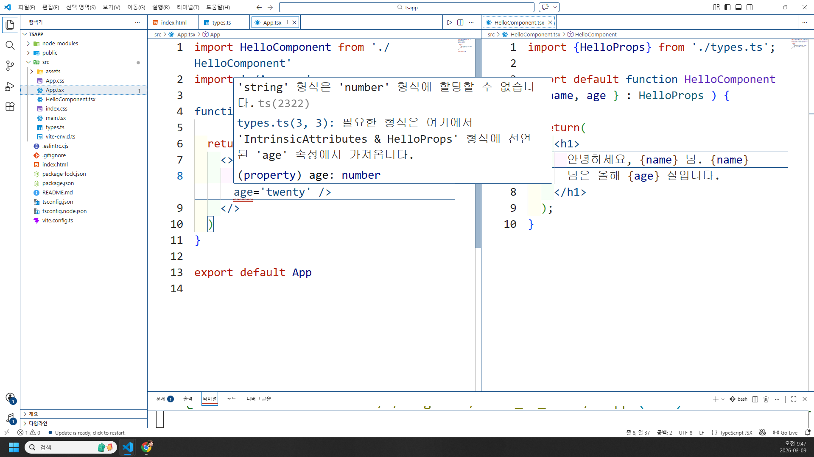

## React에서의 TypeScript 기능 이용
### State / Props
-TS를 적용했을 때는 컴포넌트 프롭의 타입을 정의해야 합니다. Coponent의 prop이 JS 객체라는 것을 배웠습니다(그래서 객체 구조분해가 가능했네요). 그러므로 TS를 적용했ㅇ르 때 프롭의 타입을 정의하기 위해 금요일에 배웠던 `type` 또는 `interface`를 이용할 수 있습니다.

HelloComponent.tsx를 생성하고 임시 string data만 return하세요. App.tsx에서 HelloComponent를 집어넣으세요.
```ts
export type HelloProps = {
  name: string;
  age: number;
}
```
이상과 같이 types.ts를 통해 자료형들을 전부 명시해둡니다(추후 프로젝트 때도 사용할 예정).
- type export의 경우에 앞에 적어주겠습니다(Component와 동일하게).

```tsx
// App.tsx
import HelloComponent from './HelloComponent'
import './App.css'

function App() {

  return (
    <>
      <HelloComponent name='김영' age='twenty' />
    </>
  )
}

export default App

// HelloComponent.tsx
import {HelloProps} from './types.ts';

export default function HelloComponent({ name, age } : HelloProps ) {

  return(
    <h1>
      안녕하세요, {name} 님. {name} 님은 올해 {age} 살입니다.
    </h1>
  );
}
```

- 이상의 코드라인과 이미지를 참조하였을 때 중요한 점은 이하와 같습니다.
1. App.tsx에 빨간줄이 떠있기는한데 브라우저에 값이 출력됩니다. 이상의 이유는 TypeScript가 JSX의 보조이기 때문에 경고만 띄운 상태에 해당하기 때문입니다. 즉 브라우저를 켜기 전에 잠재적인 오류를 잡아낼 수 있도록 하는 것이 TypeScript의 첫번째 존재 이유에 해당합니다.

```ts
export type HelloProps = {
  name: string;
  age?: number;
}
```
로 수정하면 `<HelloComponent name='김영' />`라고 작성하더라도 오류가 발생하지 않습니다. 여기서 첫 번째 존재 이유와 동일하게, `?`를 붙이지 않더라도 브라우저 자체가 출력이 안되는 일은 없다는 점입니다.

- JSX와의 차이점 중에 하나로 React + JS의 경우에는 뭐 빨간줄 뜨는 순간에 브라우저 창에 경고창 뜨면서 문법 수정하라고 난리치는 반면에 TS의 경우는 어디까지나 잠재적인 오류를 '브라우저 실행 전'에 포착하는 것이 목표이기 때문에 그것이 JSX 상의 문법적 오류가 아니라면 출력이 됩니다.

```ts
// 매개변수가 없는 함수(call1() 유형)
export type = {
  name: string;
  age?: number;
  fn: () => void;
}

// 매개변수가 있는 함수(call3() 유형)
export type = {
  name: string;
  age?: number;
  fn: (msg: string) => void;
}
```

- types.ts 형태로 미리 분리한 예시를 보여드렸지만, 추후 수업에서는 Component 내에 집어넣었다가 분리하는 과정을 연습하여 일종의 객체지향형태로 작성해보는 과정을 frontend 버전으로 수업하도록 하겠습니다.

- 이상의 경우에서 props 타입을 정의하는 방법에 대해 수업했습니다. 이번에는 state 관련 수업입니다. `useState()`를 생각해보시면 내부의 initialValue가 뭐냐에 따라서 추후 상황이 결정됩니다.
```tsx
// 문자열 초기값
const [ name, setName ] = useState('');
// 숫자 초기값
const [ age, setAge ] = useState(0);
// boolean 초기값
const [ isReady, setReady ] = useState(false);
```
그 상황에서 `setAge('ten')`이라고 입력하면 오류가 발생했었습니다. 그러면 TS를 배운 저희는 추론할 수 있는게, useState react hook을 사용하게 됐을 때, initialValue에 대한 타입 추론이 일어난다고 생각해볼 수 있겠습니다.

```tsx
const [ age, setAge ] = useState(0);
// initialValue와 다른 매개변수를 넣어서 호출
setAge('ten');
```
와 같이 작성할 경우 타입 추론을 통한 매개변수가 number 임에도 불구하고 함수의 매개변수가 string이기 때문에 타입 불일치로 인한 브라우저 return이 실패했습니다. 근데 react hook은 jsx에서도 있었기 때문에 아까 위의 예시와 달리 아예 결과값이 나오지 않았습니다.

- 상태의 타입을 '명시적으로' 정의하는 것도 가능합니다. 특히 상태를 null 또는 undefined로 초기화하려면 특히 요구됩니다. '' 안쓰고 null 쓰려면 TS가 필요하다는 의미가 되겠습니다.
```tsx
const [ message, setMessage ] = useState<string | undefined>(undefined);
```
- 이상의 코드는 금요일에 배웠던 함수에서의 매개변수 타입의 명시적 정의와 방식이 다릅니다. 그 이유는 useState라는 react hook이 tsx에서만 적용되는 것이 아니기도 하고, 이미 정의된 함수를 호출하여 message / setMessage 배열을 return한 것이기 때문에 `함수명(매개변수1:'string', 매개변수2:number) : void;`와 같은 이전에 배웠던 방법이 아니라 `<>`제네릭을 썼다는 점입니다. 이는 ts 자체가 아니라 ts와 react가 결합된 tsx 상에서의 문법이라고 보시면 되겠습니다.

- 근데 이건 상태가 하나짜리일 때에 가깝습니다. 다수의 타입을 명시해야 한다면 여태까지 해온 것처럼 type / interface를 사용할 수도 있습니다.

```tsx
type User = {
  id: number;
  name: string;
  age: number;
}

export default Example1() {
  const [ user, setUser ] = useState<User>({});

  // null이 가능하도록 하려면
  const [ user, setUser ] = useState<User | null>(null);

  return 중략
}
```

- App2.tsx 생성하고, App.tsx의 내용을 옮기고 App.tsx는 초기화하세요. -> css 는 남기겠습니다.
- Review.tsx 컴포넌트를 생성-임시-하고, App.tsx에 불러오세요.

- 현재 제출 버튼 누르고 나서도 input 창에 여전히 값이 남아있는게 불편합니다. 제출 버튼 누르고 나서는 사라졌으면 좋겠어요. 어떻게 할지 고민해보겠습니다.(todolist에서 했습니다)

# React RESTful API
- Promise
- fetch API
- Axios 라이브러리 이용

## Promise
- 비동기 연산을 처리하는 고전적인 방법은 연산의 성공 또는 실패에 콜백함수를 달아주는겁니다. 연산이 성공했을 경우에는 success 함수가 호출되고, 실패하면 failure 함수가 호출되는 방식이 되겠네요(예외처리의 고전적 방법을 떠올리시면 됩니다). 의사 코딩으로 예시 보여드리겠습니다.

```tsx
function doAsyncCall(sucess, failure) {
  if(SUCCEED) {
    success(resp);
  } else {
    failure(err);
  }
}

function success(response) {
  // 응답을 가지고 수행하게 되는 로직 작성
}

function failure(error) {
  // 오류 처리 로직을 작성
}

// 함수호출
doAsyncCall(success, failure);
```
- 이상의 예시는 Promise가 도입되기 전 방식입니다. Promise는 JS에서 비동기 프로그래밍의 기본 요소에 해당합니다.
- Promise의 정의 : 비동기 연산의 결과를 나타내는 JS 객체. 

- 이를 이용하게 되면 위에서처럼 성공 실패에 대한 함수들을 일일이 정의할 필요가 없어지기 때문에 비동기 호출을 실행할 때 코드가 단순화되는 장점이 있습니다. 그리고 콜백이 중첩되지 않기 때문에 callback hell을 겪지 않아도 됩니다.

참조 : https://developer-haru.tistory.com/57