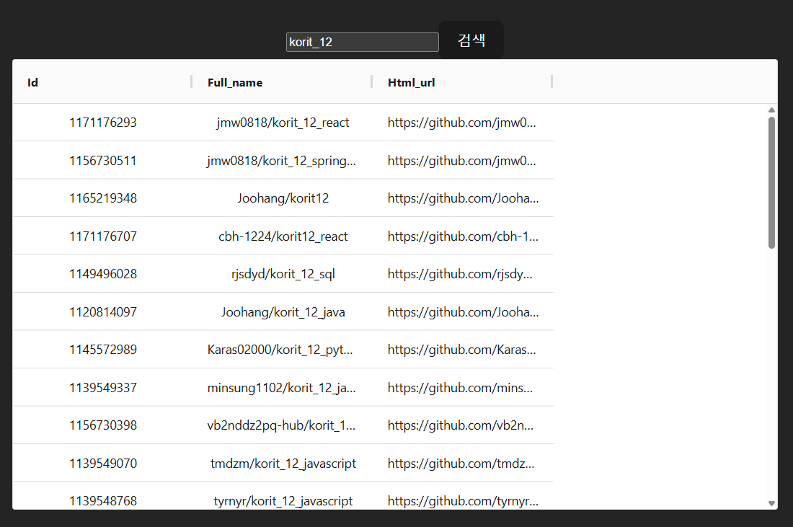
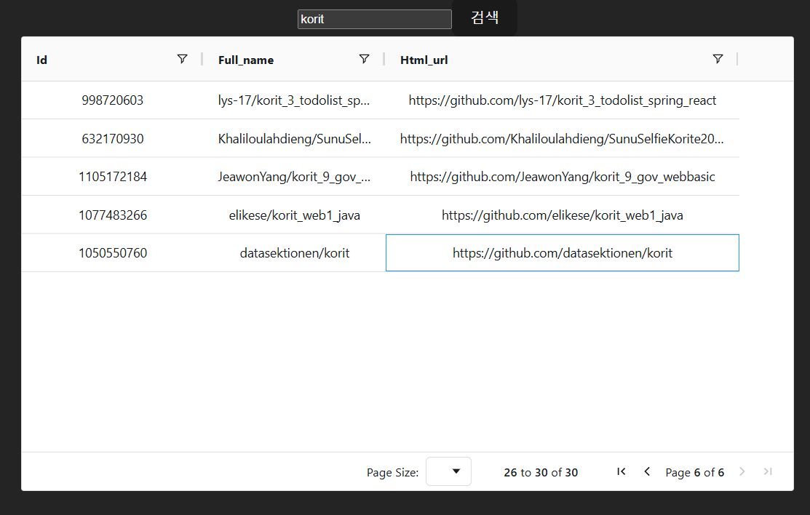
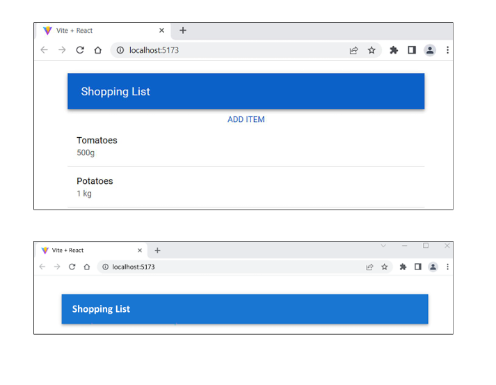
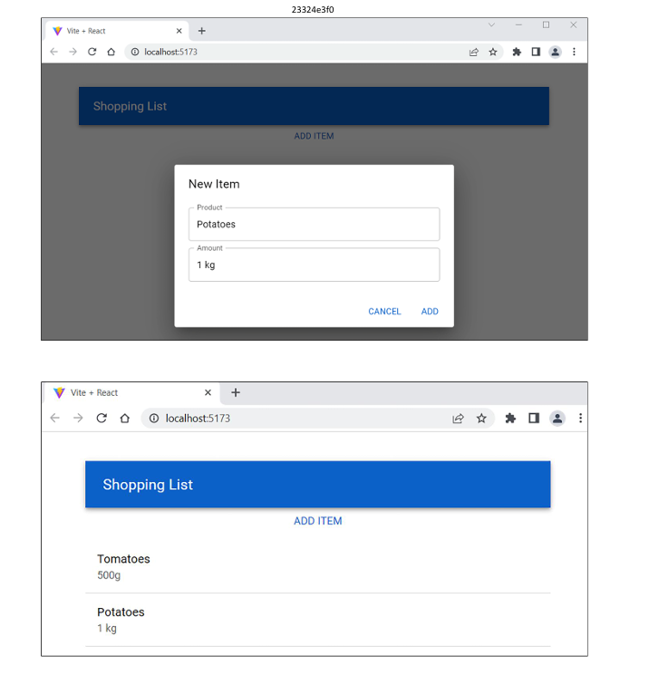

# 입실 체크 해주세요 !! 🎈

# AG Grid 이용

- AG Grid는 리액트 앱용 데이터 그리드 컴포넌트에 해당합니다. 스프레드 시트처럼 데이터를 표시하는 데 이용할 수 있으며 사용자 상호 작용도 가능합니다. 필터링, 정렬, 피벗과 같은 기능을 포함합니다.

`npm install ag-grid-community@30.0.1 ag-grid-react@30.0.1`

```tsx
import { useState } from 'react';
import axios from 'axios';
import { AgGridReact } from 'ag-grid-react';
import 'ag-grid-community/styles/ag-grid.css';
import 'ag-grid-community/styles/ag-theme-material.css';
import './App.css'

type Repository = {
  id: number; // 고유값을 통해서 나중에 .map() 적용했을 때 사용
  full_name: string;
  html_url: string;
};

function App() {
  const [ keyword, setKeyword ] = useState('');
  const [ repodata, setRepodata ] = useState<Repository[]>([]);

  const handleClick = () => {
    axios.get<{ items: Repository[] }>(`https://api.github.com/search/repositories?q=${keyword}`)
      .then(response => setRepodata(response.data.items))
      .catch(error => console.log(error));
  }

  return (
    <div className='App'>
      <input type="text" onChange={e => setKeyword(e.target.value)} value={keyword}/>
      <button onClick={handleClick}>검색</button>
      <div className="ag-theme-material"
        style={{ height: 500, width: 850 }}
      >
        <AgGridReact 
          rowData={repodata}
        />
      </div>
    </div>
  )
}

export default App
```

- 이상의 코드에서 `<AgGridReact rowData={repodata} />` 부분이 낯설 수 있습니다. ag-grid 컴포넌트에 데이터를 채우려면 컴포넌트에 rowData 프롭을 전달해줘야 합니다. 객체의 배열을 데이터에 넣을 수 있기 때문에 state에 해당하는 기존에 만들어뒀던 repodata를 이용할 수 있습니다(내부에 key-value로 이루어져있기 때문에 key가 column / value가 row가 될 겁니다), 그리고 style 정의를 해서 div 요소로 감싸줘서
```tsx
<div className="ag-theme-material"
  style={{ height: 500, width: 850 }}
>
  <AgGridReact 
    rowData={repodata}
  />
</div>/
```
과 같이 작성했습니다. 그러면 왜 귀찮게 div로 감싸줘야 하나요 같은 의문이 생길 수 있는데, 걔네가 그냥 그렇게 짠거라서 저희가 받아들여야 하는 부분에 해당합니다.

- 현재 ag-grid-community와 ag-grid-react가 버전 불일치가 발견됐습니다. 수정합니다.
1. package.json의 dependencies 파트에서 ag-grid 관련 두 개를 다 삭제했습니다.
2. node_modules에서 ag-grid 관련 폴더 두 개를 다 삭제합니다.
3. npm install ag-grid-community ag-grid-react 를 터미널에서 실행합니다.
4. vite 프로젝트가 cache을 가지고 있어서 이전 설정을 그대로 메모리에 가지고 있을 수 있습니다.
  - node_modules의 .vite 폴더를 전체 삭제해줬습니다.

```json
{
  "name": "restgithub",
  "private": true,
  "version": "0.0.0",
  "type": "module",
  "scripts": {
    "dev": "vite",
    "build": "tsc && vite build",
    "lint": "eslint . --ext ts,tsx --report-unused-disable-di`ectives --max-warnings 0",
    "preview": "vite preview"
  },
  "dependencies": {
    "ag-grid-community": "^35.1.0",
    "ag-grid-react": "^35.1.0",
    "axios": "^1.13.6",
    "react": "^18.2.0",
    "react-dom": "^18.2.0"
  },
  "devDependencies": {
    "@types/react": "^18.2.15",
    "@types/react-dom": "^18.2.7",
    "@typescript-eslint/eslint-plugin": "^6.0.0",
    "@typescript-eslint/parser": "^6.0.0",
    "@vitejs/plugin-react": "^4.0.3",
    "eslint": "^8.45.0",
    "eslint-plugin-react-hooks": "^4.6.0",
    "eslint-plugin-react-refresh": "^0.4.3",
    "typescript": "^5.0.2",
    "vite": "^4.4.5"
  }
}
```

```tsx
import { useState } from 'react';
import axios from 'axios';
import { AgGridReact }from 'ag-grid-react';
import { ColDef } from 'ag-grid-community';
import './App.css'
// 이상의 코드에서 ag-grid 관련 css를 전부 지웠습니다.

// 추가된 부분
import { ModuleRegistry, AllCommunityModule, themeQuartz } from 'ag-grid-community';
ModuleRegistry.registerModules([AllCommunityModule]);

type Repository = {
  id: number; // 고유값을 통해서 나중에 .map() 적용했을 때 사용
  full_name: string;
  html_url: string;
};

function App() {
  const [ keyword, setKeyword ] = useState('');
  const [ repodata, setRepodata ] = useState<Repository[]>([]);
  const [ columnDefs ] = useState<ColDef[]>([
    {field: 'id'}, 
    {field: 'full_name'}, 
    {field: 'html_url'},
  ]);

  const handleClick = () => {
    axios.get<{ items: Repository[] }>(`https://api.github.com/search/repositories?q=${keyword}`)
      .then(response => setRepodata(response.data.items))
      .catch(error => console.log(error));
  }

  return (
    <div className='App'>
      <input type="text" onChange={e => setKeyword(e.target.value)} value={keyword}/>
      <button onClick={handleClick}>검색</button>
      <div className="ag-theme-material"
        style={{ height: 500, width: 850 }}
      >
        <AgGridReact 
          rowData={repodata}
          columnDefs={columnDefs} 
          theme={themeQuartz}
        />
      </div>
    </div>
  )
}

export default App
```

version up을 (30->35) 반영한 AG grid 관련 코드입니다.

- 기본적인 grid를 확인할 수 있는 상태가 되었습니다.


- 이상의 상태에서 sorting / filtering 기능을 추가하는 것도 가능합니다.

- 그러니까 지금 ColDef에 관련된 properties를 학습하고 있는중입니다. 현재는 field / sortable / filter 세 개를 사용해봤는데 다양한 설정들이 존재하기 때문에 reference 공식 사이트를 첨부하겠습니다.
https://www.ag-grid.com/react-data-grid/column-properties/


- 이상까지가 pagination을 적용한 버전입니다. 그런데 잘 생각해보시면 html_url 등을 가지고 온 이유가 `<a>`태그 적용을 통해서 클릭하면 해당 페이지로 넘어갈 수 있게끔 하는 것이었는데, repodata에 있는 html_url의 자료형인 string 데이터를 그대로 가지고 왔기 때문에 현재의 ag-grid 상황에서는 링크가 동작하지않는다는 것을 확인할 수 있습니다.

- 이상의 문제를 해결하기 위해서 cellRenderer 프롭을 이용하여 grid의 셀 컨텐츠를 커스텀하는 것이 가능합니다. 

```tsx
const [ columnDefs ] = useState<ColDef[]>([
    {field: 'id', sortable: false, filter: true}, 
    {field: 'full_name', sortable: true, filter: true}, 
    {field: 'html_url', sortable: true, filter: true},
    {
      field: 'full_name',
      cellRenderer: (params: ICellRendererParams) => (
        <button
          onClick={() => alert(params.value)}
        >
          Press Me ❤️
        </button>
      )
    }
  ]);
```

- 이상의 코드에서 주목할 점은 결과적으로 네 번째 column을 만들어냈다는 점입니다. 여태까지는 json 데이터를 default 값으로 가져왔기 때문에 string 데이터의 형태로만 봤지만 html 태그를 집어넣는 방식으로 커스텀하기 위해 1-3번 컬럼과는 다른 cellRender라는 key-value property를 이용했고, 내부에서 button 태그를 만들었으므로 onClick 등의 이벤트를 이용할 수 있고, 클릭할 때만 함수가 작동해야 하기 때문에 arrow function을 응용했습니다. 결과적으로 이전 수업들의 내용이 중첩적으로 적용되고 거기에 새로운 거 하나 추가된다는 것을 확인할 수 있습니다.

- 응용하고 싶다면 alert 말고 진짜 페이지 이동을 구현하셔도 됩니다. 그렇다면 full_name field를 쓸게 아니라 html_url을 구현하시는 게 낫겠네요.

# Material UI 컴포넌트 이용 라이브러리 - Shoppinglist

- MUI란 구글의 material 디자인 언어를 구현하는 리액트 컴포넌트 라이브러리입니다. 여기 내부에 버튼 / list / table / card 등의 다양한 컴포넌트가 있어서 균일한 사용자 인터페이스(UI)를 구현할 수 있습니다.

- 이건 개발자용 장점이고 개발자지망생 장점으로는 백엔드만 만들어놓고 프론트 부분에 CSS 신경 안쓰고 포트폴리오를 막 찍어낼 수 있다는 점이 되겠습니다.




shoppinglist 앱 생성하시오. -> React / TypeScript 채용할 것.

App.tsx 초기화할 것

mui 의존성 추가

npm install @emotion/react@11.11.1
npm install @emotion/styled@11.11.0
npm install @mui/material@5.14.8

```tsx
import { Container, AppBar, Toolbar, Typography } from '@mui/material';
import { useState } from 'react';
import './App.css'


function App() {

  return (
    <>
      <Container>
        <AppBar position='static'>
          <Toolbar>
            <Typography variant='h6'>
              Shopping List
            </Typography>
          </Toolbar>
        </AppBar>
      </Container>
    </>
  );
}

export default App
```
이상의 코드에서 새로운 컴포넌트들을 작성했습니다.
1. Container : MUI의 기본 레이아웃 컴포넌트로 컨텐츠를 가로 중앙에 배치하는 데에 이용됩니다. maxWidth 프롭을 이용하여 컨테이너 최대 너비를 지정할 수 있는데, 기본값은 'lg'입니다.(large를 의미함) 여기서 알 수 있는 것은 MUI는 숫자를 값으로 받기도 하지만 방금 본것철럼 lg 와 같은 방식으로 string 축약어를 값으로 받기도 합니다.

2. Typograpy : 미리 정의된 텍스트 크기를 제공하며, 해당 예시에서는 h6라는 값을 variant 프롭으로 전달했는데, 이는 MUI가 적용된 `<h6>` html 태그를 쓴 것과 같은 효과를 냅니다. 결과적으로는 일일이 다른 html 태그를 외울 것이 아니라 글자 쓸거면 `<Typography>`를 일단 자동완성으로 작성한 다음에 props 전달로 형태를 바꿀 수 있겠네요.

- AddItem component를 생성했습니다. 여기서는 저희가 단일 input창과 button을 이용해서 todolist나 github repository 검색을 했던 것과 달리 다수의 컴포넌트들이 합쳐져서 하나의 페이지를 만드는 것을 연습해볼건데, shoppinglist에서는 Modal을 이용할겁니다. 이상의 이미지에서 봤던 것처럼 두 개의 input 창과 addItem 함수를 호출하는 버튼을 추가하게 될겁니다. 근데 우리가 App.tsx에 addItem() 함수를 정의해놨기 때문에 상위 컴포넌트에서 하위 컴포넌트로 addItem() 함수를 변수 형태로 전달해줘야 할 것 같습니다. 그것 때문에 `export default function AddItem(props){}`로 작성했습니다. 